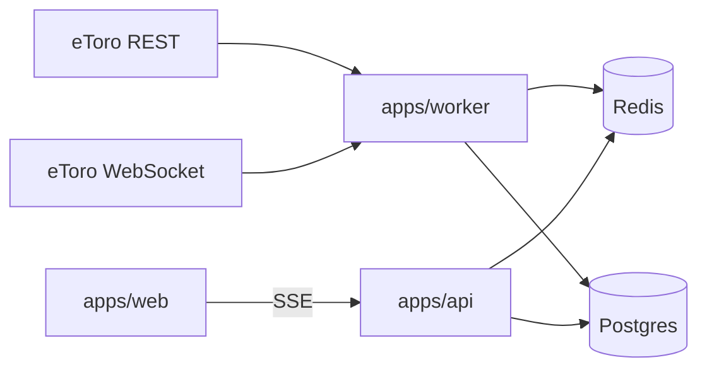

# Market Sentinel

Personal market-intelligence and trading-discipline platform. It watches configured eToro instruments, explains setups, and enforces risk rules. It is **not** an autonomous live-money trading bot.

See `SPEC.md` for the product contract.

## Architecture

```text
apps/web      Next.js dashboard (no eToro secrets)
apps/api      Fastify HTTP + health/SSE
apps/worker   Persistent market-data process
packages/*    Pure domain, broker client, db, config
```



## Tech stack

pnpm, Turborepo, Next.js, Fastify, Zod, Drizzle, PostgreSQL, Redis, Vitest, Playwright, Pino.

## Setup

```bash
cp .env.example .env
# add ETORO_API_KEY and ETORO_USER_KEY to .env — never NEXT_PUBLIC_*
docker compose up -d
pnpm install
pnpm --filter @market-sentinel/db migrate
pnpm dev
```

Validation:

```bash
pnpm test
pnpm typecheck
pnpm lint
```

## eToro API / MCP

`.cursor/mcp.json` points at the hosted eToro Public API MCP server. Before implementing any eToro route, use `get-all-routes` and `get-route-spec`. Do not invent endpoints. Milestone 1 routes were taken from official OpenAPI `v1.365.1` because the hosted MCP required credentials for catalog access in this environment — see `docs/adr/ADR-007-etoro-route-discovery.md`.

Register keys at [api-portal.etoro.com](https://api-portal.etoro.com/).

## Environment

| Variable | Where | Notes |
| --- | --- | --- |
| `ETORO_API_KEY` | server only | Never `NEXT_PUBLIC_` |
| `ETORO_USER_KEY` | server only | Never `NEXT_PUBLIC_` |
| `DATABASE_URL` | server | Postgres |
| `REDIS_URL` | server | Redis |
| `TELEGRAM_BOT_TOKEN` | server only | Optional. Never `NEXT_PUBLIC_` |
| `TELEGRAM_CHAT_ID` | server only | Optional. Never `NEXT_PUBLIC_` |

## Safety

Live-money order placement is out of scope until a later milestone. The eToro client in this repository is read-only.

## Strategies

Four versioned detectors ship in Milestone 4: `breakdown-retest@1.0.0`, `sweep-reclaim@1.0.0`, `trend-pullback@1.0.0`, and advisory `do-not-chase@1.0.0`.

## Roadmap

0. Repo foundation
1. eToro connectivity
2. Candles and indicators — `/markets/:symbol` chart, 15m/1h/4h storage, RSI/ATR/EMA/BB
3. Structure and zones — pivots, HH/HL/LH/LL, auto/manual zones, regime, MultiTimeframeContext
4. Signals
5. Alerts — in-app inbox, optional Telegram, event-driven SSE
6. Account / risk / Trade Gate — official PnL snapshot, positions/history, risk engine, manual news blackouts
7. Journal and analytics — broker matching, MAE/MFE, gated vs ungated
8. Backtest / replay
9. Demo execution only
